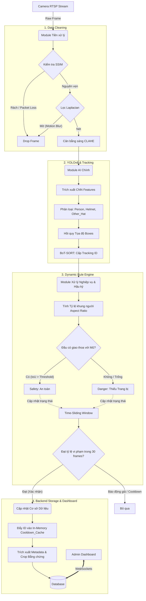

# TÀI LIỆU KỸ THUẬT: THIẾT KẾ HỆ THỐNG VÀ PIPELINE XỬ LÝ (Mục 3a)

Tài liệu này cung cấp cấu trúc chi tiết và nền tảng lý luận kỹ thuật (Technical Rationale) để đáp ứng yêu cầu của Mục `3a` trong File Tiêu chí Đánh giá (`criteria.txt`). Sử dụng trực tiếp dữ liệu này làm kịch bản thuyết trình và chèn vào báo cáo Word/Slide.

---

## 1. Xác định các Module xử lý hình ảnh/video

Để đảm bảo hệ thống tiệm cận với chuẩn công nghiệp, luồng dữ liệu không đi thẳng từ Camera vào AI, mà được bảo vệ và tối ưu qua 4 Module độc lập:

*   **Module 1: Pre-processing (Tiền xử lý và làm sạch dữ liệu)**
    *   **Anti-glitch (SSIM):** Trực tiếp đo lường mất mát cấu trúc (Structural Similarity) trên RTSP stream. Loại bỏ các khung hình bị rách (tearing) hoặc mất gói tin mạng.
    *   **Blur Detection:** Dùng toán tử `Variance of Laplacian` theo thời gian thực để nhận diện chóp chuyển động. Tự động drop các khung hình bị thuống (mờ nhòe) do công nhân chạy nhanh.
    *   **Lighting Adjustment:** Ánh xạ biểu đồ tương phản cục bộ `CLAHE`. Tự động cân bằng vùng sáng tối, hóa giải hiện tượng "cháy sáng" hoặc "ngược sáng" do hướng mặt trời mà không gây nhiễu toàn khung ảnh.
*   **Module 2: Feature Extraction & Main Model (Trích xuất & Suy luận)**
    *   Hệ thống sử dụng mạng `YOLOv8` (kiến trúc One-stage CNN) chạy đa nhiệm (multi-task). YOLO sẽ tạo chung các bản đồ đặc trưng (Feature maps) dùng để hồi quy tọa độ (Bounding box regression) cho cả `Người` và `Mũ` đồng thời.
*   **Module 3: Rule Engine & Hậu xử lý (Geometrical Logic)**
    *   `BoT-SORT Tracker`: Cấp phát thẻ định danh (ID) và theo dõi đối tượng trên đa khung hình, bù đắp ảnh hưởng khi Camera hoặc đối tượng chuyển động che lấp nhau.
    *   `Dynamic Aspect Ratio Map`: Không dùng tọa độ cắt cứng. Hệ thống tính tỷ lệ khung hình Người để linh hoạt thiết lập vùng tìm kiếm "Đầu" tương ứng (Chống lỗi phạt nhầm khi công nhân cúi gập gối nhặt đồ vạch ngang màn hình). Đem gộp IoU ghép Mũ vào Đầu.
*   **Module 4: Alert Validation (Bộ lọc Cảnh báo Nhiễu cuối)**
    *   Time-Sliding Window ngăn chặn cảnh báo nhấp nháy do bị chướng ngại vật cản camera trong tích tắc.
    *   Cắt ảnh và đẩy siêu dữ liệu (Metadata: Thời điểm, Tọa độ bounding box, Mức tự tin) vào Database để làm bằng chứng.

---

## 2. Thiết kế Kiến trúc tổng thể & Máy trạng thái hệ thống

Sơ đồ dưới đây (Lưu ý: copy đoạn code này dán vào Notion hoặc bất kỳ công cụ hỗ trợ Mermaid JS để view biểu đồ) minh họa dòng chảy của bất cứ một khung hình nào đi qua hệ thống.

---

## 3. Lựa chọn Mô hình & Chiến lược Transfer Learning

### A. Lý luận lựa chọn Mô hình
Lựa chọn kiến trúc One-stage (YOLOv8) thay vì Two-stage (như Faster R-CNN) hay Transformer (ViT) dựa trên nguyên tắc trade-off môi trường thực tế:
1.  **Chi phí tính toán môi trường biên (Edge computing):** Đa số camera hoạt động 24/7 cần xử lý local qua máy chủ công trường. YOLO tối ưu cực hạn số lượng phép toán dấu phẩy động (FLOPs), có thể chạy Real-Time (>30FPS) trên GPU tầm trung (như T4 hoặc Jetson). Two-stage bị sụp nghẽn (bottleneck) nếu trong ảnh có mật độ công nhân dày đặc.
2.  **BoT-SORT vượt trội hơn DeepSORT:** Ở môi trường xây dựng, vật cản (cột, máy xúc) xuất hiện liên tục. BoT-SORT sở hữu tính năng theo dõi chuyển động camera và kết hợp góc nhìn không gian, giúp ID công nhân không bị mất hay reset khi họ lùi ra sau tường rồi đi ra lại.

### B. Chiến lược Huấn luyện Model (Training Strategy)
Hệ thống sử dụng kỹ thuật Huấn luyện tiếp chuyển (Transfer Learning) từ bộ tạ có sẵn (Pretrained Weights trên tập COCO) để tăng tốc độ hội tụ và độ linh hoạt cho các biên khối hình.

**1. Kỹ thuật "Hard-Negative Mining" thông qua phân loại 3 Nhãn (3 Classes):**
Thay vì mô hình Nhị phân kinh điển (`Có đội mũ` / `Không đội mũ`), ta đưa hệ thống vào trạng thái Cố tình đặt bẫy:
*   Mô hình được Train với 3 Lớp: `Helmet` (Mũ bảo hộ cứng theo chuẩn), `Other_Hat` (Nhãn mồi: Nón lá, mũ xe máy, mũ len, nón vải...), và `No_Helmet`. 
*   Việc ép mạng Model tự học khác biệt giữa Mũ chuẩn và Mũ vải triệt tiêu hoàn toàn tỷ lệ Dương tính giả (False Positives) dành cho những trường hợp cố tình dùng nón lá để lách luật tại công trường.

**2. Chiến lược Tăng cường Dữ liệu Đặc thù (Data Augmentation):**
*   **Hệ màu HSV thay vi Hệ màu RGB truyền thống:** Không dùng thao tác nhiễu RGB thông thường. Hệ màu HSV (Hue - Saturation - Value) được sử dụng để tách bạch ánh sáng (V) ra khởi phổ màu của Mũ (H). Nhờ augment trên Value, lưới Model trở nên "miễn nhiễm" với các hiện tượng Mũ bảo hộ bằng nhựa bóng bị chói/lóa sáng dưới góc nắng gắt.
*   Kết hợp thuật mã hóa cắt xén hình ảnh (`Mosaic augmentation`) để mô phỏng sự hỗn loạn khi có cụm đám đông công nhân che lấp nhau.
