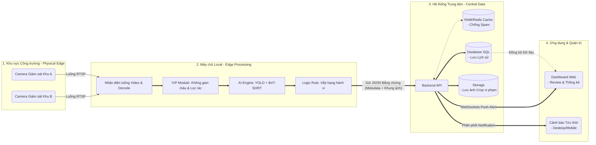
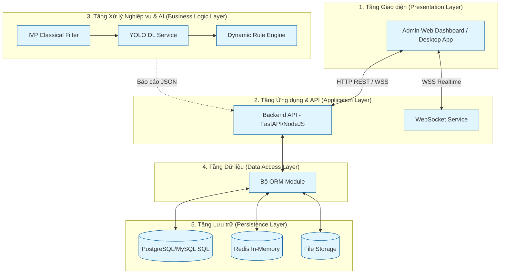
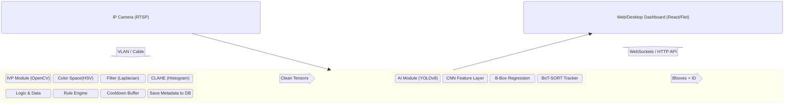
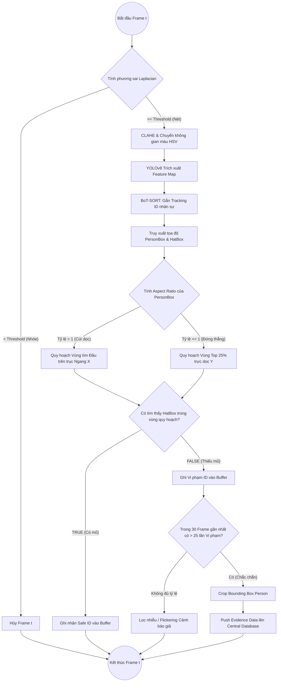

# TÀI LIỆU THIẾT KẾ ĐỒ ÁN: HỆ THỐNG GIÁM SÁT BẢO HỘ LAO ĐỘNG (Hybrid IVP & AI)

*Tài liệu này được thiết kế theo chuẩn đặc tả yêu cầu phần mềm và luận văn học thuật. Điểm nhấn lớn nhất là việc tách bạch và làm nổi bật phần **Xử lý Ảnh và Video truyền thống (IVP)** để hội đồng/giảng viên thấy rõ lượng kiến thức của môn học được áp dụng vào đồ án, thay vì chỉ phụ thuộc vào Deep Learning (YOLO/LLM).*

---

## 1. Phân tích yêu cầu bài toán
### 1.1 Yêu cầu nghiệp vụ (Business Requirements)
*   Hệ thống có khả năng phân tích luồng Video/RTSP Stream từ camera công trường theo thời gian thực.
*   Nhận diện công nhân có mặt trong khung hình nhưng KHÔNG lưu trữ danh tính sinh trắc học để tối ưu chi phí (Chỉ phát sinh Tracking ID).
*   Giám sát và đưa cảnh báo khi phát hiện công nhân thiếu trang thiết bị bảo hộ, trọng tâm MVP là **Mũ bảo hộ (Helmet)**.

### 1.2 Yêu cầu Xử lý Ảnh (IVP Requirements) - *Nền tảng môn học*
*   Phải áp dụng các phép biến đổi không gian màu, phép lọc nhiễu, đạo hàm không gian để tiền xử lý khung hình trước khi đưa vào mô hình học sâu.
*   Video thực tế rung lắc, ánh sáng phức tạp (ngược sáng, lóa sáng) phải được giải quyết bằng thuật toán xử lý ảnh truyền thống.

### 1.3 Yêu cầu phi chức năng (Non-functional)
*   **Performance:** FPS (Frame per second) của toàn bộ pipeline duy trì mức >= 20 FPS trên phần cứng GPU tầm trung.
*   **Độ trễ (Latency):** Dưới 500ms tính từ lúc bắt hình đến khi đẩy cảnh báo về Database.

---

## 2. Thiết kế Pipeline Xử lý (Hybrid Processing Pipeline)
Kiến trúc luồng xử lý lai (Hybrid) kết hợp sức mạnh của thị giác máy tính cổ điển (Classical Computer Vision - IVP) và học sâu (Deep Learning).

### 2.1 Các Giai đoạn (Phases)
1. **Giai đoạn Thu nhận Video (Video Acquisition):** Bắt luồng RTSP camera 1080p, giải mã (decode) H264 thành mảng đa chiều (Tensors).
2. **Giai đoạn Xử lý Ảnh Tín hiệu gốc (Traditional IVP - Đất diễn của nhóm):** Làm mịn ảnh, đo lường tần số không gian đồ (spatial frequency), tăng cường độ tương phản.
3. **Giai đoạn Định vị & Phân loại học sâu (AI Inference):** Trích xuất tọa độ Bounding box của Người và Mũ.
4. **Giai đoạn Hình học Giải tích (Geometric Engine):** Liên kết thực thể Mũ vào Người.

---

## 3. Phân rã Chi tiết các Module Hệ thống

Đây là phần mang đi báo cáo (Present) với TS để chứng minh nhóm làm ra một đồ án Xử lý Ảnh đúng nghĩa.

### 3.1 Module Tiền xử lý Ảnh (Image Pre-processing Module) - *Đất diễn số 1*
Thay vì đẩy ảnh RAW thẳng vào YOLO, nhóm thiết kế một Module dùng các phép biến đổi ma trận để làm sạch ảnh.
*   **a. Biến đổi Không gian Cơ sở (Color Space Transformation):** Chuyển ảnh góc RGB sang hệ màu **HSV (Hue-Saturation-Value)** để bóc tách yếu tố "Độ rọi" (Value). Mũ bảo hộ trên công trường thường bị mặt trời chiếu lóa (trắng xóa). Việc khử/cân chỉnh kênh V (Value) giúp giữ lại màu màu Vàng/Trắng của cấu trúc mũ mà không bị mất nét.
*   **b. Tăng cường Độ tương phản Thích ứng (CLAHE):** Histogram Equalization (HE) truyền thống làm dội nhiễu. Sử dụng thuật toán `CLAHE (Contrast Limited Adaptive Histogram Equalization)` chia ảnh ra các ô `8x8 grid`, tính toán lại biểu đồ tần suất (histogram) cho từng ô cục bộ để xử lý tình huống ngược sáng công trường.
*   **c. Định lượng Biến Thiên Cạnh (Edge Variance Filtering):** Áp dụng hạt nhân (Kernel) theo **toán tử Laplacian** để tính Gradient mép cạnh (Edge gradient). Dựa trên phương sai (Variance) của mảng ma trận Laplacian, nếu nhỏ hơn một ngưỡng Threshold định sẵn -> Đây là frame bị mờ (do camera rung gió hoặc người chạy gấp). Hệ thống drop luôn frame để tiết kiệm 100% tài nguyên chạy YOLO. 

### 3.2 Module Học Sâu (Deep Feature Extraction Module)
*   Sử dụng YOLOv8 làm Backbone. Module này lấy ảnh đã qua làm sạch tại 3.1 để hồi quy Bounding Box tĩnh (Trích xuất các ô chữ nhật chứa Người, Mũ chuẩn, Nón thời trang/No Helmet).
*   Lý do chọn YOLO: Xử lý mạng chập tích phân One-stage, không có Region Proposal (như Faster RCNN) -> Đáp ứng phần cứng cấu hình thấp tại biên Edge.

### 3.3 Module Lai (Hybrid Validation Module) - *Đất diễn số 2*
*   **Tìm kiếm Mũ bằng Hình thái học (Morphological Verification):** Trong các góc phức tạp, nhóm bổ sung một luồng phụ. Cắt lấy ROI (Region của bounding box Person). Áp dụng thuật toán **Canny Edge Detection** để tìm kiếm viền cong bán nguyệt (tố chất hình học của chiếc mũ) để đối chiếu chéo (Cross-check) với kết quả nhận hình dáng của AI. 
*   **Tính toán tỷ lệ khung (Aspect Ratio Heuristic):** Dùng toán học Tỷ lệ Width/Height của hộp bao người (`Aspect_ratio = w / h`). Nếu tỷ lệ dẹt > 1 (Người đang cúi gập), kích hoạt tính toán vùng đỉnh đầu dịch chuyển sang bên mép rìa (X-axis) thay vì nắp dọc (Y-axis). 

---

## 4. Kiến trúc Tổng thể (Overall System Architecture)

Hệ thống tuân theo thiết kế mô hình **Edge-to-Cloud (Từ Biên lên Trung tâm)**, là kiến trúc tiêu chuẩn trong các giải pháp IoT và Smart Surveillance hiện đại nhằm giải quyết bài toán thắt cổ chai bằng băng thông (Bottleneck). Kiến trúc được chia thành 4 Tầng (Zones) chuyên biệt:

### 4.1 Zone 1: Khu vực Công trường (Physical Edge)
* **Vai trò:** Khởi tạo dữ liệu. Camera (IP/CCTV) liên tục thu phát tín hiệu luồng Video theo chuẩn **RTSP (Real Time Streaming Protocol)**.
* **Technical Rationale:** Tầng này được thiết kế thuần tủy làm "Dummy Node" (Thu hình thuần), không tích hợp bộ xử lý AI nội bộ nhằm tối ưu chi phí đầu tư thiết bị.

### 4.2 Zone 2: Máy chủ Xử lý Biên (Edge Processing)
* **Vai trò:** Trung tâm chẩn đoán đồ họa. Local Server đặt ngay tại công trường chịu trách nhiệm nhồi toàn bộ công suất tính toán toán học (IVP) và học sâu (YOLOv8) để phân tích hình ảnh. 
* **Technical Rationale (Đột phá hệ thống):** Việc không gửi trực tiếp Video từ Zone 1 lên Cloud cứu hệ thống khỏi cái chết lâm sàng do sập băng thông. Edge Server sau khi xử lý xong chỉ tổng hợp ra một lệnh JSON vài Kilobytes (chứa ID, tọa độ vi phạm) và một tầm ảnh bằng chứng nhỏ gọn để đẩy lên mạng, giảm trên 99% áp lực đường truyền.

### 4.3 Zone 3: Hệ thống Trung tâm (Central Backend Data)
* **Vai trò:** Hệ thống não bộ lưu trữ chạy trên Cloud (AWS/VPS), quản lý API (NodeJS/FastAPI), Database (Ghi nhận lịch sử vi phạm) và Storage.
* **Technical Rationale (Cơ chế Chống Spam):** Chìa khóa hệ thống nằm ở cụm **RAM/Redis Cache**. Nếu một công nhân đứng nói chuyện liên tục 15 phút, Local Edge sẽ dội hàng ngàn lệnh vi phạm về máy chủ. Lớp in-memory Cache đóng vai trò khóa (Cooldown). Nếu ID#10 đã ghi nhận vi phạm, cache sẽ chặn mọi lệnh ghi vòng lặp tương tự trong 5 phút tiếp theo. Điều này bảo vệ Data SQL khỏi bị "banh chành" ổ lưu trữ.

### 4.4 Zone 4: Tầng Ứng dụng Quản trị (Dashboard)
* **Vai trò:** Tiếp nhận và báo động theo thời gian thực (Real-time).
* **Technical Rationale:** Sử dụng biểu thức giao tiếp **WebSockets** cấu trúc đa chiều thay vì HTTP truyền thống. Khi Zone 3 có cảnh báo, WebSocket Push Alert trực tiếp về màn hình trong vòng chưa tới 0.1 giây mà không cần bảo vệ phải tải lại trang (F5).

---

**Sơ đồ System Overview Tổng thể (Global Topology):**

---

## 5. Kiến trúc Phần mềm (Software System Architecture)

Trong khi *System Overview* mô tả việc phân bổ dữ liệu vật lý qua mạng lưới mạng, **Kiến trúc Phần mềm (Software Architecture)** mô tả cách các khối code (mô-đun) bên trong vương quốc phần mềm liên kết với nhau. Hệ thống sử dụng mô hình **Kiến trúc Đa tầng (N-Tier/Layered Architecture)** kết hợp với **Bất đồng bộ (Asynchronous)**. Việc chia tầng (Layering) giúp đạt được tính *Tách biệt mối quan tâm (Separation of Concerns)*.

### 5.1 Giải thích lý luận kiến trúc đa tầng (Technical Rationale)
Hội đồng thường rất ghét việc gom chung code Xử lý Ảnh, logic lưu Database và API vào trong cùng 1 file mã nguồn duy nhất (Spaghetti code). Bằng cách thiết kế theo N-Tier:
*   **1. Tầng Giao diện (Presentation Layer):** Triển khai giao diện thuần túy (Flet/Vue...). Đảm bảo tính thân thiện và bảo mật vì không ai có thể can thiệp thẳng vào hệ thống phía sau từ màn hình bảo vệ.
*   **2. Tầng Ứng dụng & Vận chuyển (Application Layer):** Bọc toàn bộ hệ thống bằng một API Framework (FastAPI/Express). Nhiệm vụ là mở một cổng (Port) duy nhất để chống lại các luồng truy cập trái phép, đồng thời chịu trách nhiệm "bơm" dữ liệu Realtime qua WebSockets.
*   **3. Tầng Xử lý Nghiệp vụ & Trí tuệ (Business Logic & AI Layer):** Được xem là "khối não". Đặc điểm ăn tiền ở đây là tách biệt API (giao tiếp mạng) với IVP và AI. Khối AI cứ việc chạy ma trận, nhả object về cho Rule Engine. Rule Engine sẽ đóng gói ra Alert gửi lên Application Layer.
*   **4. Tầng Tiếp cận Dữ liệu (Data Access Layer - DAL):** Tầng này dùng **ORM (Object-Relational Mapping)** để giao tiếp CSDL. Khuyến nghị này là vũ khí tuyệt đối bảo vệ dự án khỏi các lỗi bảo mật nguy hiểm như SQL Injection.
*   **5. Tầng Lưu trữ Đa mô hình (Persistence Layer):** Sự lai tạo giữa Relational DB (SQL: Lưu lịch sử dài hạn vững chắc), In-memory DB (Redis: Tốc độ chớp nhoáng phục vụ Cooldown/Session), và File System (Lưu ảnh tĩnh).

### 5.2 Sơ đồ Kiến trúc Đa tầng (N-Tier Diagram)

---

## 6. Sơ đồ Khối (Block Diagram)

Sơ đồ thể hiện khối liên kết vật lý và thư viện.

---

## 7. Sơ đồ Thuật toán Vận hành (Operational Flowchart)

Thể hiện lưu đồ ra quyết định trên mỗi một khung hình (Frame) riêng lẻ. Cấu trúc để thiết kế hàm thuật toán (Function scope).

---

## 8. Lựa chọn Mô hình Học Sâu & Kịch bản Huấn luyện
1. Lựa chọn Mô hình: **YOLOv8 Nano/Small (n/s).** Mô hình nhỏ kết hợp với việc tiền xử lý sạch sẽ (Pre-processed sạch) có thể vượt qua độ chính xác của YOLOv8 Large mà không chịu sức nặng thuật toán dư thừa.
2. Nhãn Huấn Luyện (Classes):
    * `0: helmet` (Chiếc mũ cấu trúc an toàn)
    * `1: person` (Con người đứng làm mốc)
    * `2: pseudo_hat` (Vật thể ngụy trang mũ: Nón cối, áo trùm đầu, xô châu, nón lá - nhằm loại trừ False Positives lách luật công trường).
3. Đánh giá thuật toán: Phân tích dựa trên đường biểu đồ Loss-Function (Box loss, Obj loss, Cls loss) và đánh giá độ chập thông qua Ma trận nhầm lẫn (Confusion Matrix).
